*This project was created as part of the 42 curriculum by nocrespo.*

---

# call me maybe

## Description

This project implements a **function calling** tool that translates natural language requests into structured function calls with typed arguments.

Given a prompt like `"What is the sum of 2 and 3?"`, the program does not return `5`, but instead:

```json
{
  "prompt": "What is the sum of 2 and 3?",
  "name": "fn_add_numbers",
  "parameters": {"a": 2.0, "b": 3.0}
}
```

The system uses the **Qwen/Qwen3-0.6B** model (500M parameters) together with **constrained decoding** to guarantee 100% valid JSON output, achieving near-perfect reliability even with a small model.


---

## Instructions

### Prerequisites

- [uv] installed on the system
- The `llm_sdk/` directory copied to the project root (provided with the subject)

### Installation

```bash
uv sync
```

### Running the program

```bash
# with default files
uv run python -m src

# with custom paths 
uv run python -m src --input data/input/function_calling_tests.json --functions_definition data/input/functions_definition.json --output data/output/function_calling_results.json
```

### Other commands

```bash
make install   # install dependencies
make run       # run the program
make debug     # run in debug mode with pdb
make lint      # run flake8 and mypy
make clean     # remove caches and virtual environment
```

### Input files

The program reads two files from the `data/input/` directory:

- `function_calling_tests.json` — list of natural language prompts
- `function_definitions.json` — definitions of the available functions

### Output file

The program generates `data/output/function_calling_results.json` with the result for each prompt.

---

## Constrained Decoding

LLMs generate text token by token. At each step, the model produces a probability distribution (logits) over all possible tokens in the vocabulary (~150,000 tokens in Qwen3).

Without constraints, a small model like Qwen3-0.6B generates valid JSON only ~30% of the time. Constrained decoding solves this by intervening at each generation step:

1. The model produces logits for all possible tokens
2. Valid tokens are identified based on what is being built
3. Logits of invalid tokens are set to `-infinity`
4. The valid token with the highest probability is selected

### Phase 1 — Function Selection

A prompt describing the available functions is built and constrained decoding is used so the LLM can only generate tokens that form a valid function name. At each step, the vocabulary is checked to find which tokens can continue any of the available function names.

### Phase 2 — Argument Extraction

For each argument of the selected function, a new prompt is built and generation is restricted based on the argument type:

- `number` — only allows tokens that form a valid number (digits, decimal point, negative sign)
- `string` — allows any token until a newline is found
- `boolean` — only allows tokens that form `True` or `False`

---

## Performance Analysis

- **Accuracy**: constrained decoding guarantees the function name is always valid and arguments always have the correct type.
- **Speed**: the Qwen3-0.6B model on CPU takes approximately 2 minutes per prompt. On GPU the time is significantly reduced, taking approximately 5 minutes for 11 prompts.
- **JSON reliability**: 100% — constrained decoding makes it impossible to generate malformed JSON.

---

## Usage Examples

```bash
# basic run
uv run python -m src

# with custom files
uv run python -m src --input my_folder/tests.json --functions_definition my_folder/functions.json --output my_folder/results.json
```

Example `function_calling_tests.json`:
```json
[
  {"prompt": "What is the sum of 2 and 3?"},
]
```

Example `function_definitions.json`:
```json
[
  {
    "name": "fn_add_numbers",
    "description": "Add two numbers",
    "parameters": {
      "a": {"type": "number"},
      "b": {"type": "number"}
    },
    "returns": {"type": "number"}
  }
]
```

Example output `function_calling_results.json`:
```json
[
  {
    "prompt": "What is the sum of 2 and 3?",
    "name": "fn_add_numbers",
    "parameters": {"a": 2.0, "b": 3.0}
  }
]
```

---

